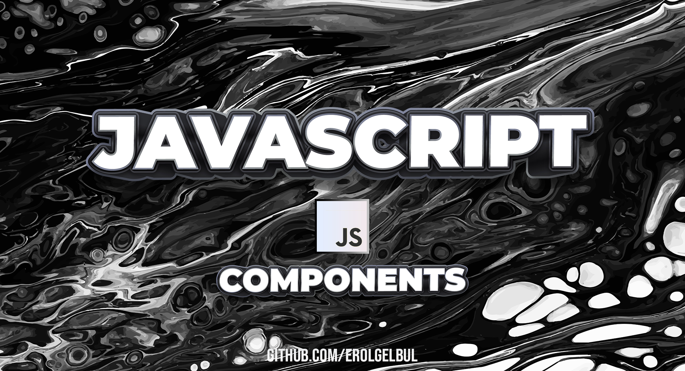
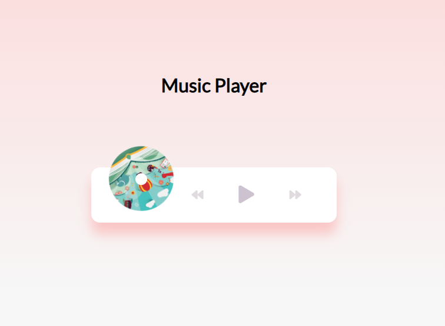
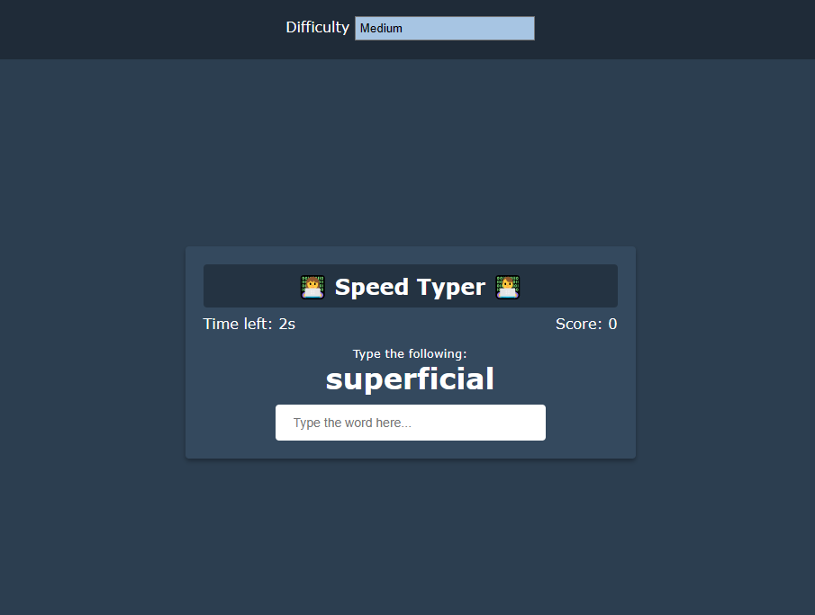
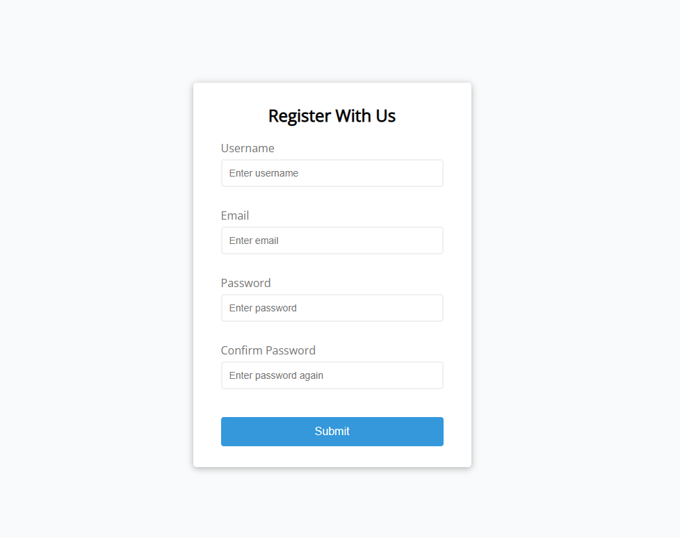

  

<!-- ABOUT THE PROJECT -->
## 1. Vanilla JS Components

### 1.1 Basic Form Validator

  

### 1.2 Music Player

  

### 1.3 Typing Game

  

<!-- CONTACT -->
## 2. Contact

Erol Gelbul - [Website](erolgelbul.com)

Project Link: [JS Components](https://github.com/ErolGelbul/js_components)

(<a href="#top">back to top</a>)
